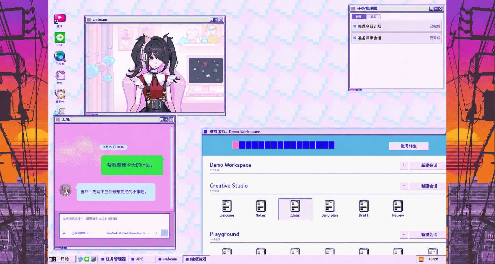

# Internet Angel Desktop · 超绝网络天使桌面

简体中文 | [English](README.en.md) | [日本語](README.ja.md)

**把 DSH Web 变成 windose20 的操作系统。**

受《主播女孩重度依赖》启发的非官方、非商业饭制皮肤。
在 JINE 里对话，在任务管理器看任务过程，在 POKETTER 阅读结果，再从桌面窗口间继续你的工作。



> **开发中 · 测试阶段**：功能与布局仍在调整，部分设备、浏览器、缩放比例或宿主版本可能遇到问题。

## 这张桌面里有什么

- 可拖动、缩放和最小化的窗口，以及开始菜单、任务栏和存档入口。
- JINE 对话、POKETTER 结果与任务管理器，让长任务有自己的位置。
- webcam 角色展示、代办、番茄钟与中英文界面。
- 可通过皮肤管理器调整字体、角色和声音。BGM 与 SE 默认关闭，想听声音记得调高音量。
- 成分复杂的彩蛋。

## 安装与皮肤管理器

需要已经可以运行的 DSH Web。推荐搭配
[skin-manager 皮肤管理器](https://github.com/Small-tailqwq/dsh-deep-whale/tree/main/skin-manager)，
用于切换皮肤和调整此皮肤的定制选项。

在终端中依次运行（将 `web` 替换为你使用的 profile 名称）：

```powershell
dsh plugin --profile web add 'github:Small-tailqwq/dsh-deep-whale#path:/skin-manager'
dsh plugin --profile web add 'github:Small-tailqwq/dsh-internet-angel-desktop'
```

安装完成后重启 DSH Web，在 **设置 → 皮肤管理** 中选择本皮肤。多个皮肤同时启用时，
管理器可能先回到官方默认界面，再手动选择一套即可。本仓库与推荐的皮肤管理器均已公开，可直接使用上面的 GitHub 安装命令。

**这是针对 DSH Web 的界面皮肤，不是独立游戏。**宿主兼容声明见 [skin.json](skin.json)；
它不是对其他版本、所有设备或第三方插件的通用兼容承诺。

## 反馈范围

**本项目不受理任何第三方插件兼容性问题反馈。**
大多数插件在这套伪桌面体系中都需要单独适配，其入口、弹窗和布局不能直接套用官方界面。
缺少插件入口、插件窗口被隐藏、与其他插件叠加后的显示异常等，不在本项目的问题受理范围内。
上面推荐的皮肤管理器有明确接入用途，不代表提供通用插件兼容支持。

皮肤自身的问题欢迎反馈。可以让你的 Agent 先定位并整理，再由 Agent 在你授权后
[提交 issue](https://github.com/Small-tailqwq/dsh-internet-angel-desktop/issues/new/choose)。
请按模板提供 DSH / 皮肤版本、操作系统、浏览器、缩放比例、复现步骤、预期与实际结果，
以及经过脱敏的截图或错误日志。尽量确认问题在关闭其他非必要插件后仍然出现，并搜索已有 issue。
不要上传访问令牌、密钥、完整聊天记录或包含个人目录的日志。

## 开发

```powershell
pnpm install
pnpm typecheck
pnpm build
pnpm build:manifest
```

源码与内联素材模块位于 `src/`，安装产物位于 `lib/`。修改后同步构建产物与构建指纹。
测试集中在 `tests/`；构建和单元测试不能替代真实设备上的视觉与交互验证。
欢迎围绕皮肤本身提供可复现问题和小范围改进。

## 版权与素材

本项目不是原作网页移植，也未获得原作、DSH、相关制作组或发行方的官方授权、赞助或背书。
项目维护者只维护皮肤实现，不拥有其中第三方游戏、字体及客户端素材的权利。

本仓库目前没有授予通用开源许可证；**能够查看源码不等于获得素材再分发或商业使用授权**。
非商业用途声明也不替代权利人的许可。完整的素材归属、来源类别与待确认事项见
[资产归属报告](assets/ATTRIBUTION.md)和[版权声明](NOTICE.md)。权利人可通过 issue 联系维护者处理相关素材。

## 致谢

感谢某神秘论坛的 `amechanll`，以及众多提出宝贵意见和创意的兄弟姊妹。谢谢你们一起让这套桌面变得更加有趣。
